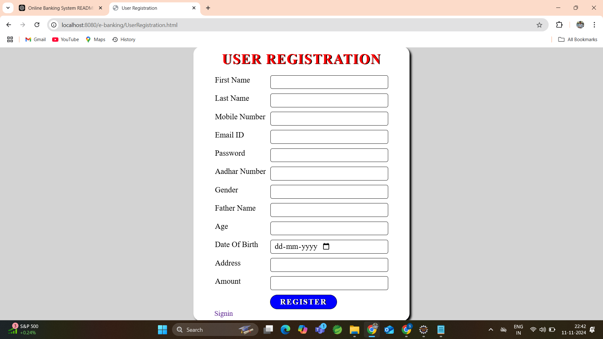
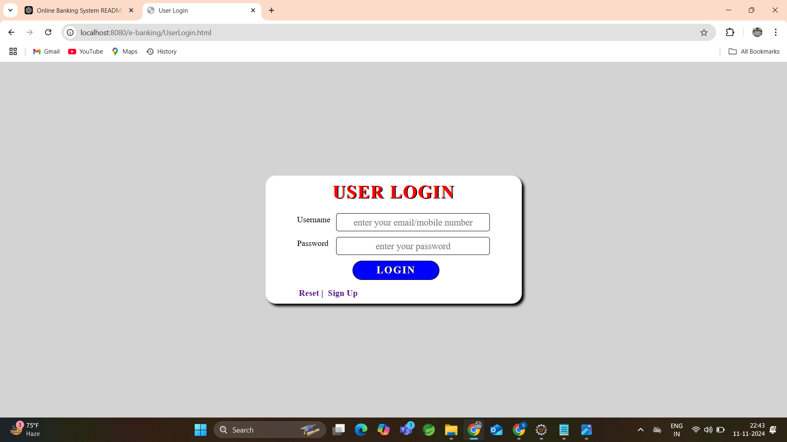
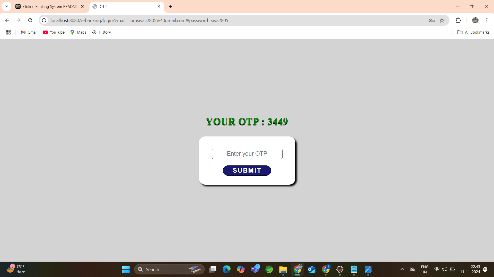
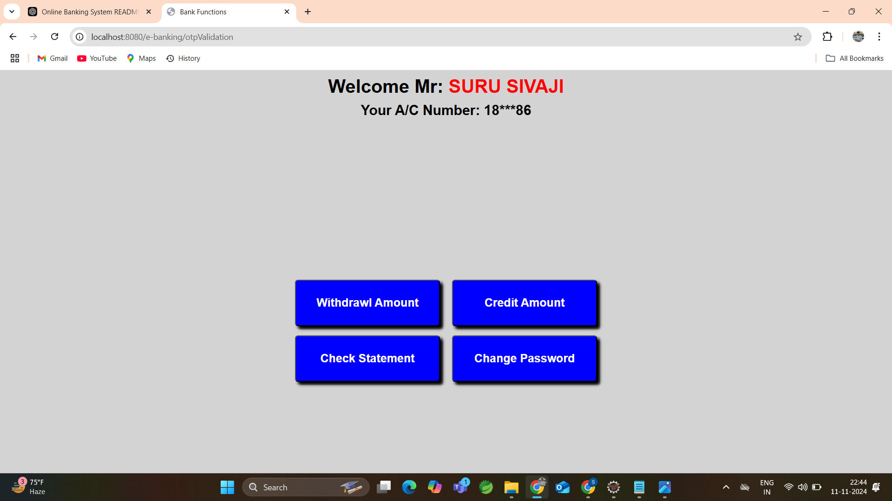
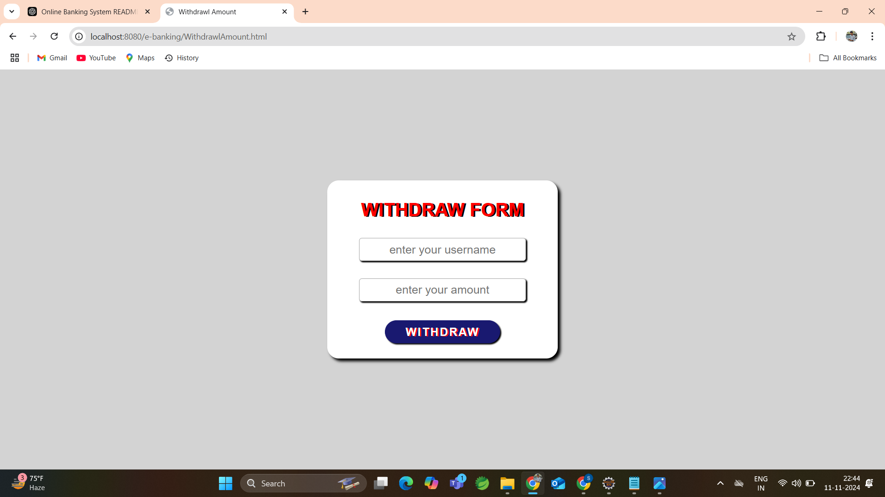
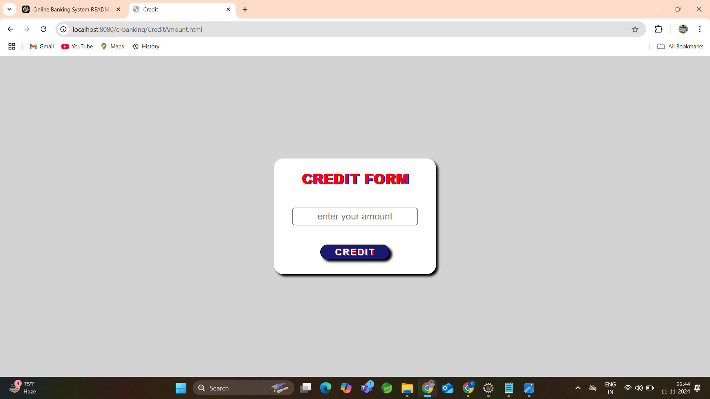
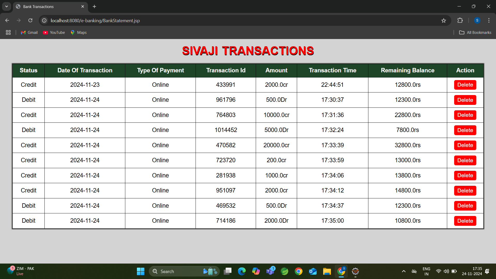
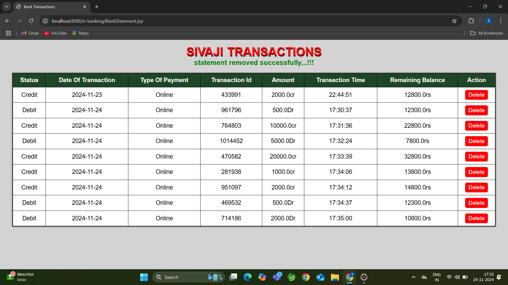

<h2 align="center">🌟 E-Banking Application 🌟</h2>

This project is a simple banking application developed with <b>Java</b>, <b>JDBC</b>, <b>Servlets</b>, <b>JSP</b>, <b>HTML</b>, and <b>CSS</b>. It provides essential banking features such as crediting, debiting, checking balances, transferring money, and changing passwords. The application follows a structured, three-layer architecture for modular and organized code.

<h2>✨ Features</h2>
<ul>
  <li>🔐 <b>User Registration</b>: Sign up to create a new account.</li>
  <li>👤 <b>User Login</b>: Securely log in with your credentials.</li>
  <li>💰 <b>Credit Amount</b>: Add funds to your account balance.</li>
  <li>💸 <b>Debit Amount</b>: Withdraw funds from your account.</li>
  <li>🔄 <b>Transfer Money</b>: Send funds to other accounts.</li>
  <li>📊 <b>Check Balance</b>: View your account balance in real time.</li>
  <li>🔒 <b>Change Password</b>: Securely update your account password.</li>
</ul>

<h2>💻 Technologies Used</h2>
<ul>
  <li><b>Backend</b>: Java, JDBC, Servlets</li>
  <li><b>Frontend</b>: JSP, HTML, CSS</li>
  <li><b>Database</b>: JDBC for database operations and data persistence</li>
  <li><b>Session Management</b>: Using session objects to handle user interactions and states across sessions</li>
</ul>

<h2>🏗️ Project Architecture</h2>

The project is organized into a <b>three-layer architecture</b>:

<h3>Model Layer</h3>
<ul>
  <li>Contains <b>POJO (Plain Old Java Object) classes</b> representing database tables.</li>
  <li>Enables seamless data transfer between the application and the database.</li>
</ul>

<h3>DAO Layer</h3>
<ul>
  <li>Handles <b>all database interactions</b> with CRUD (Create, Read, Update, Delete) operations.</li>
</ul>

<h3>Servlet Layer</h3>
<ul>
  <li>Manages <b>HTTP requests and responses</b>.</li>
  <li>Implements business logic for core banking operations like credit, debit, transfer, and password change.</li>
</ul>

<h2>📖 Usage</h2>
<h3>1. User Registration</h3>

Access the registration page to create a new account.

<h3>2. Login</h3>

Log in with your registered credentials to access account functionalities.

<h3>3. Banking Operations</h3>
<ul>
  <li>💳 <b>Credit</b>: Add funds to your account.</li>
  <li>🏧 <b>Debit</b>: Withdraw funds from your account.</li>
  <li>🔀 <b>Transfer</b>: Transfer funds between accounts.</li>
  <li>📈 <b>Check Balance</b>: View your current balance.</li>
  <li>🔐 <b>Change Password</b>: Securely update your account password.</li>
</ul>

<h3>4. Logout</h3>

End the session to securely log out of your account.

<h2>📸 Screenshots</h2>

Below are screenshots of the application's key interfaces to demonstrate user flow:

    <h3>Registration Page</h3>
    
    
Figure 1: User Registration Page

    <h3>Login Page</h3>
    
    
Figure 2: User Login Page

    <h3>OTP Verification Page</h3>
    
    
Figure 3: OTP Verification Page

    <h3>Home Page (Dashboard)</h3>
    
    
Figure 4: Home Page / Dashboard

    <h3>Withdraw Page</h3>
    
    
Figure 5: Withdraw Funds Page

    <h3>Credit Page</h3>
    
    
Figure 6: Credit Funds Page

    <h3>Show Transactions</h3>
    
    
Figure 6: Show User Transactions

    <h3>Remove Transactions</h3>
    
    
Figure 6:  Remove Transactions

<h2>🛠️ Project Setup</h2>

Follow the steps below to set up and run the E-Banking Application locally:

<h3>Prerequisites</h3>
<ul>
  <li><b>JDK 8 or higher</b> installed on your machine.</li>
  <li><b>Apache Tomcat</b> server to deploy the application.</li>
  <li><b>MySQL</b> database (or any other compatible database) for storing user data and transaction history.</li>
  <li><b>IDE (Integrated Development Environment)</b> such as IntelliJ IDEA, Eclipse, or NetBeans for coding and running the project.</li>
</ul>

<h2>🎉 Enjoy Your Banking Experience!</h2>

We hope you enjoy using the E-Banking Application! 💳💰 Whether you're managing your finances or exploring the core features, this project aims to provide a smooth and secure banking experience. If you have any feedback or suggestions, feel free to reach out. Have fun and take control of your finances!

Happy Banking! 😄

