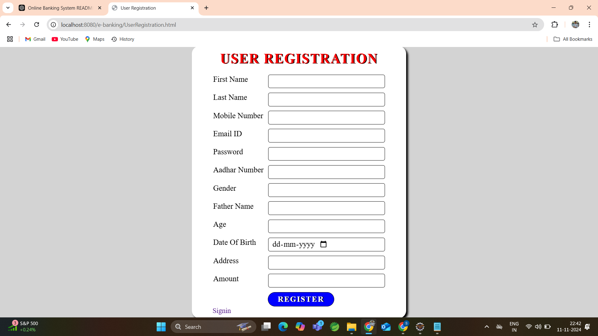
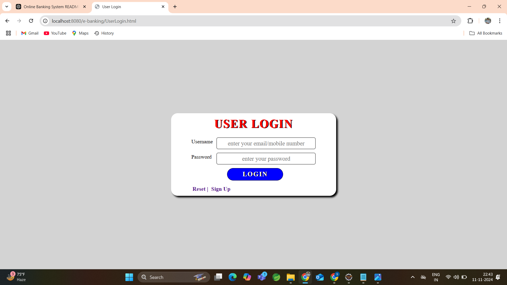
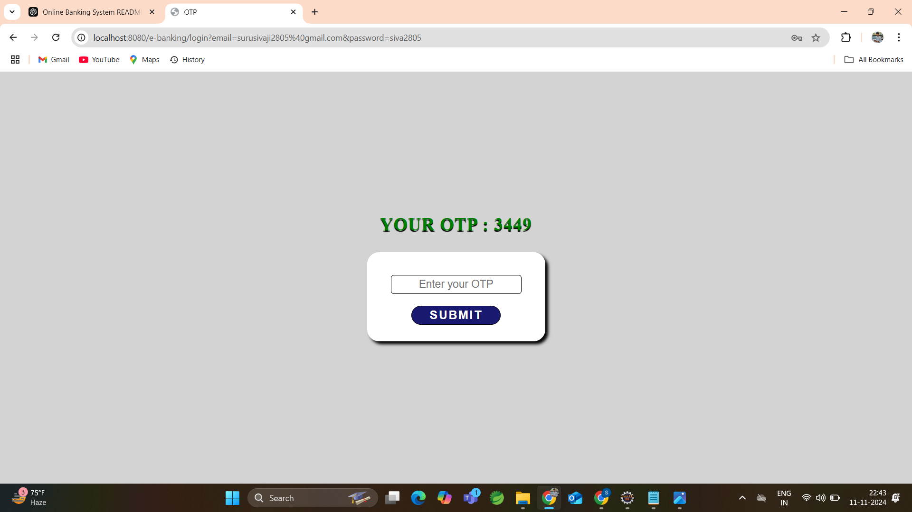
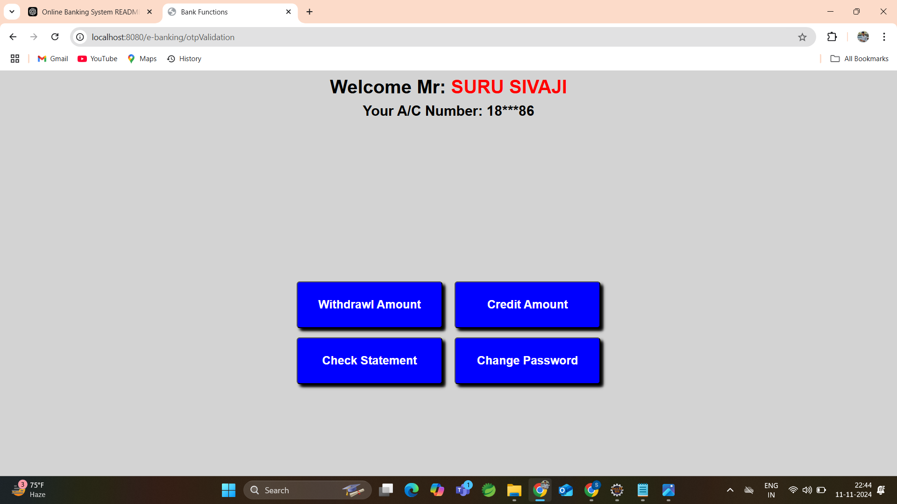
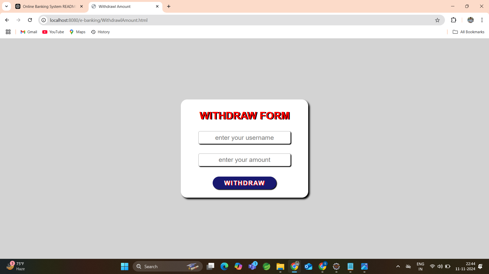
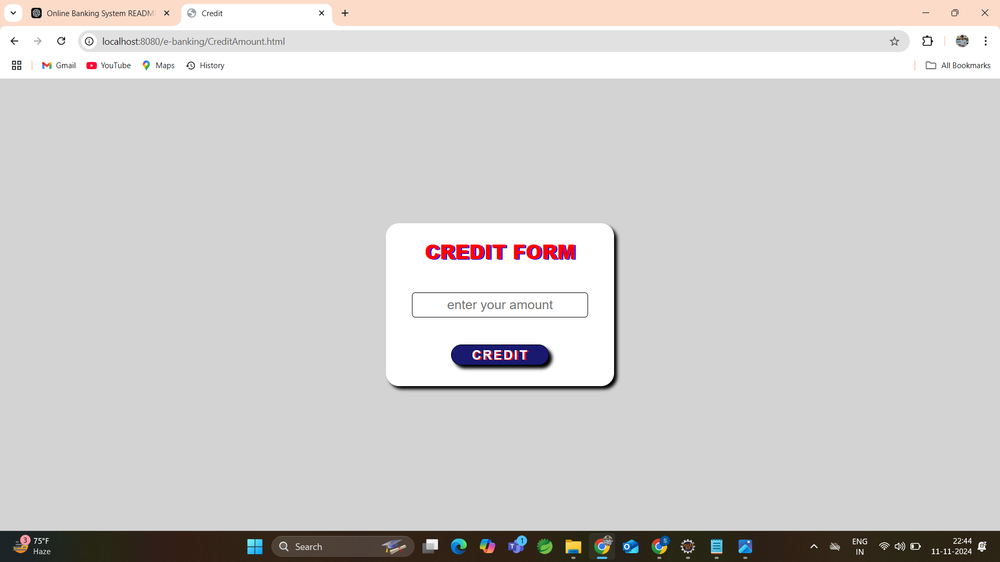

<h2 align="center">🌟 E-Banking Application 🌟</h2>

This project is a simple banking application developed with **Java**, **JDBC**, **Servlets**, **JSP**, **HTML**, and **CSS**. It provides essential banking features such as crediting, debiting, checking balances, transferring money, and changing passwords. The application follows a structured, three-layer architecture for modular and organized code.

---

## ✨ Features

- 🔐 **User Registration**: Sign up to create a new account.
- 👤 **User Login**: Securely log in with your credentials.
- 💰 **Credit Amount**: Add funds to your account balance.
- 💸 **Debit Amount**: Withdraw funds from your account.
- 🔄 **Transfer Money**: Send funds to other accounts.
- 📊 **Check Balance**: View your account balance in real time.
- 🔒 **Change Password**: Securely update your account password.

---

## 💻 Technologies Used

- **Backend**: Java, JDBC, Servlets
- **Frontend**: JSP, HTML, CSS
- **Database**: JDBC for database operations and data persistence
- **Session Management**: Using session objects to handle user interactions and states across sessions

---

## 🏗️ Project Architecture

The project is organized into a **three-layer architecture**:

### Model Layer
- Contains **POJO (Plain Old Java Object) classes** representing database tables.
- Enables seamless data transfer between the application and the database.

### DAO Layer
- Handles **all database interactions** with CRUD (Create, Read, Update, Delete) operations.

### Servlet Layer
- Manages **HTTP requests and responses**.
- Implements business logic for core banking operations like credit, debit, transfer, and password change.

---

## 📖 Usage

### 1. User Registration
- Access the registration page to create a new account.

### 2. Login
- Log in with your registered credentials to access account functionalities.

### 3. Banking Operations
- 💳 **Credit**: Add funds to your account.
- 🏧 **Debit**: Withdraw funds from your account.
- 🔀 **Transfer**: Transfer funds between accounts.
- 📈 **Check Balance**: View your current balance.
- 🔐 **Change Password**: Securely update your account password.

### 4. Logout
- End the session to securely log out of your account.

---

## 📸 Screenshots

Below are screenshots of the application's key interfaces to demonstrate user flow:

### Registration Page

Figure 1: User Registration Page

### Login Page

Figure 2: User Login Page

### OTP Verification Page

Figure 3: OTP Verification Page

### Home Page (Dashboard)

Figure 4: Home Page / Dashboard

### Withdraw Page

Figure 5: Withdraw Funds Page

### Credit Page

Figure 6: Credit Funds Page

---
